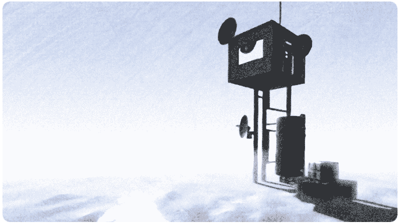

# Windless Bay
An interactive fiction based on R-Page engine

## What is this?
Windless Bay, Mount Erebus. A research station deep into Antarctica, this is where your journey begins...

## Technical stuff
* A game for the Amiga Classic range of computers
* Built on top of [R-Page](https://github.com/ResistanceVault/rpage)
* A short interactive fiction (mostly half a dozen of different places)
